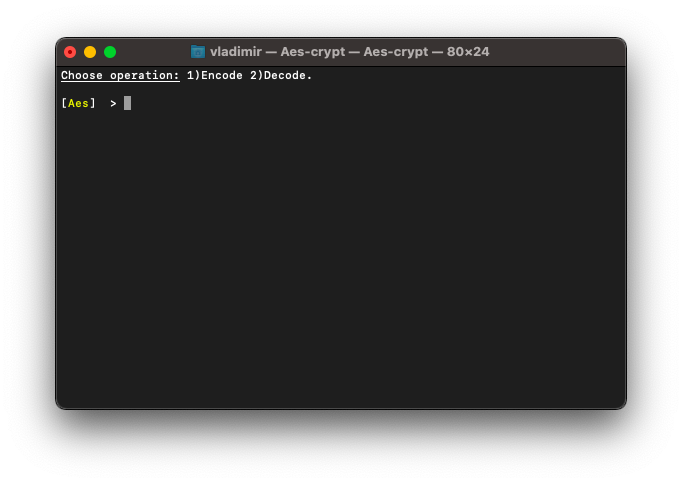
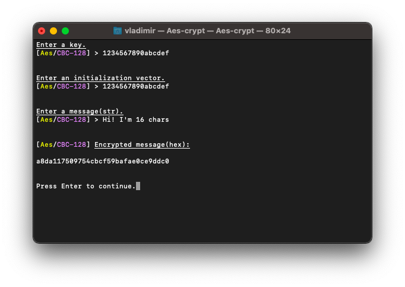
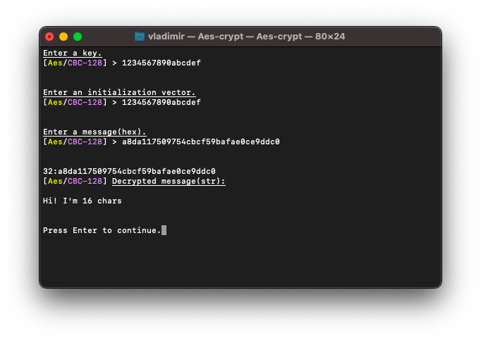

# 🔑 AES_Implementation [](https://github.com/Red-company/RES_Implementation/blob/main/LICENSE.md) [](https://github.com/vladimirrogozin/AES_Implementation) 



## WARNING:
This repository was the first version of _AES_, for a newer one check [_RedLibrary_](https://github.com/Red-company/RedLibrary).

## What is it?

This is a small and portable _C++17_ implementation of the _Advanced Encryption Standartd(AES)_. At this repository you also can find _'Aes-crypt'_ terminal application which helps you to _encrypt/decrypt strings_. It is a part of [_RedLibrary_](https://github.com/Red-company/RedLibrary).

## Where to use?

_AES_ can be used everywhere you need. It's got strong encryption level and has pretty good perfomance. But if you're looking for algorithm for specific task, I have an option with excess level of encryption, here it is: [_RES_](https://github.com/Red-company/RES_Implementation).

## What does AES consist of?
_AES_ includes 2 encryption modes: [_ECB_](https://en.wikipedia.org/wiki/Block_cipher_mode_of_operation#Electronic_Codebook_.28ECB.29) and [_CBC_](https://en.wikipedia.org/wiki/Block_cipher_mode_of_operation#Cipher_Block_Chaining_.28CBC.29) with 3 key length cases for each of them:

* _ECB_
  * _AesECB 128 bits key_
  * _AesECB 192 bits key_
  * _AesECB 256 bits key_
  
* _CBC_
  * _AesCBC 128 bits key_
  * _AesCBC 192 bits key_
  * _AesCBC 256 bits key_
  
## How to use it?

There are 7 header files(6 with algorithms and 1 with shared definitions) and 6 source files(for each of algorithm).

```C
// AesECB128.h
const std::string EncryptAesECB128(const std::string& in, const std::string_view key);
const std::string DecryptAesECB128(const std::string& in, const std::string_view key);

// AesECB192.h
const std::string EncryptAesECB192(const std::string& in, const std::string_view key);
const std::string DecryptAesECB192(const std::string& in, const std::string_view key);

// AesECB256.h
const std::string EncryptAesECB256(const std::string& in, const std::string_view key);
const std::string DecryptAesECB256(const std::string& in, const std::string_view key);

// AesCBC128.h
const std::string EncryptAesCBC128(const std::string& in, const std::string_view key, const std::string_view iv);
const std::string DecryptAesCBC128(const std::string& in, const std::string_view key, const std::string_view iv);

// AesCBC192.h
const std::string EncryptAesCBC192(const std::string& in, const std::string_view key, const std::string_view iv);
const std::string DecryptAesCBC192(const std::string& in, const std::string_view key, const std::string_view iv);

// AesCBC256.h
const std::string EncryptAesCBC256(const std::string& in, const std::string_view key, const std::string_view iv);
const std::string DecryptAesCBC256(const std::string& in, const std::string_view key, const std::string_view iv);
```
**Tech notes:**
 * Padding is provided only for _"in"_ params. _"Iv"_ should equals 16 bytes. Key length(in bytes) is calculated using the formula: _`KEY_LENGTH / 8`_.
 * _ECB_ mode is considered unsafe for most uses and is not implemented in streaming mode. See [_wikipedia's article on ECB_](https://en.wikipedia.org/wiki/Block_cipher_mode_of_operation#Electronic_Codebook_(ECB)) for more details.
 * This library is designed for small code size and simplicity, intended for cases where small binary size, low memory footprint and portability is more important than high performance.

**Notes:**
 * If you want to route result of encryption to _`std::cout`_, you should convert string to hexadecimal system, in other way you will get bad output!
  * **Convertion functions are included in each of examples.**
 * There is no built-in error checking or protection from out-of-bounds memory access errors as a result of malicious input.

## Want to build your own standard?
If you're interested in building your standard on the base of this one, you can find everything you need to know in _'YOUR_STANDARD_GUIDE.txt'_.

## Screenshots? Here they are:

Here's an example of encryption in _CBC128_ mode:



And the following one is the decryption of previous message:



##
All material in this repository is in the public domain.
